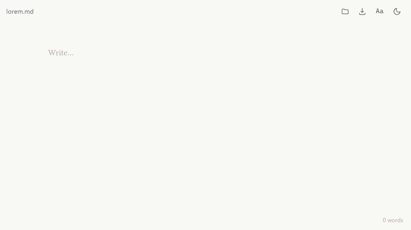

# md-writer

An elegantly minimal writer for `.md` files.

Markdown stopped being a developer format. It is how we take notes, draft specs,
brief agents and keep the files that AI tools read and write all day —
`README.md`, `CLAUDE.md`, `AGENTS.md`, plans, transcripts, handoffs. Most of that
text is edited in an IDE that treats prose as source code, or in a notes app that
wants to own the file and hand it back as something else.

md-writer is the small thing in between: a calm page that renders markdown as you
type it, and saves plain text back exactly where it came from. Press F11 to get
fullscreen and enjoy a super clean interface to simply write, or read.

## What it does

The text you see **is** the markdown. There is no preview pane and no
round-trip through a rich-text model — headings get bigger, quotes get a rule,
code goes monospace, and the syntax itself stays on screen, dimmed to the margin.
Nothing is hidden from you and nothing is rewritten behind your back.

Heading marks hang in the left margin, so the prose stays flush while `##` sits
outside it. What you save is byte-for-byte what you wrote.

## Running it

Open `index.html` in a browser. That's the whole install. Or host it on your own
domain — like we do on https://md.ivar.studio

It is one file — no build step, no dependencies, no bundler, no server, no
telemetry. Drop it on any static host, or keep it as a local bookmark. The only
network request is the webfont, which falls back to a system serif offline.

## Files

Ctrl+S saves in place, over the file you opened, using the browser's file system
API. No download folder, no "export", no copy drifting away from the original.

- **Ctrl+O** or drag a file onto the window to open
- **Ctrl+S** to save, **Ctrl+Shift+S** to save as
- A dot next to the filename and in the tab title means unsaved
- Closing with unsaved changes asks first

In browsers without the file system API (currently Firefox and Safari), opening
uses a file picker and saving falls back to a download.

## Keys

- **Ctrl+B** / **Ctrl+I** — wrap the selection in `**` or `*`
- **Ctrl+Z** / **Ctrl+Y** — undo, redo
- **Tab** — two spaces

Undo is custom, not the browser's, and coalesces bursts of typing into sensible
steps rather than one keystroke at a time.

## Syntax

Headings, bold, italic, strikethrough, inline code, fenced code blocks, links,
images, blockquotes, bullet and ordered lists, task lists, and horizontal rules.
Checked task items fade out.

Anything else — tables, footnotes, HTML — is left alone as plain text. It is not
styled, and it is never mangled or dropped.

## Reading the room

Three controls in the header, and they stay out of the way:

- **Aa** switches between serif and monospace, and reveals a text size slider
  (70–160%)
- **Sun/moon** switches light and dark; untouched, it follows your system
- Word count sits bottom right, and shows the selection count while you have one

All of it persists in `localStorage`. Nothing else is stored, and nothing leaves
the browser.

## Windows

A native Windows app is on its way to the Microsoft Store. It's the same page
in a small WinUI 3 shell, and it adds right-click → Open with for markdown,
text and log files, one window per file, live reload when a file changes on
disk, and saving that keeps each file's encoding and line endings. It works
fully offline. The source and build steps are in [windows/](windows/).

## Android

A native Android version is in the works — the same design and the same grammar,
built on Android's own text stack rather than a WebView. It will be linked here
once it is on Google Play.

## License

MIT © IVAR Studios. That covers the source code, including the Windows app.

The md-writer name and icon belong to IVAR Studios and aren't covered by the MIT
license. You're welcome to build, change and share the code, but a
redistributed version needs its own name and icon.
