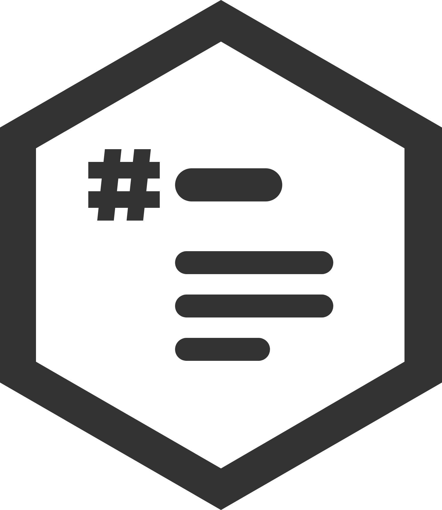

# md-writer icon



## What it shows

- **A markdown heading.** Its `#` hangs in the left margin, as it does in the app, so the heading and the text
  under it stay flush.
- **Three lines of body text** under it: two full lines and a shorter one. They're the same round-ended lines as
  the caption in IVAR SMP's icon.
- **The IVAR hexagon** around it, with the same proportions, frame weight and ink as the other IVAR Studios tools
  (Photo Culler, Ingest, SMP).

It's black and white on purpose, like the others, so it works on light and dark taskbars.

## Files

| File | Use |
|---|---|
| `md-writer-icon.svg` | The master drawing. Edit this one; everything else is built from it. |
| `md-writer-icon.png` | The SVG rendered 2000 px high. Kept in git so the icon can be rebuilt without Edge. |
| `windows/MdWriter/Assets/*` | The Windows app's `app.ico` and MSIX logos (Start, taskbar, Store, tiles). |
| `index.html` favicon | The same drawing inlined as a data URI, so the web version stays one file. Update it by hand if the SVG changes. |

`windows/tools/New-AppIcon.ps1` renders the SVG with Microsoft Edge (headless) and writes all of these:

```
powershell -File windows\tools\New-AppIcon.ps1              # render and build
powershell -File windows\tools\New-AppIcon.ps1 -SkipRender  # build from md-writer-icon.png
```

## Drawing

In the SVG's units (`viewBox="0 0 173.2 200"`):

| Part | Specification |
|---|---|
| Hexagon | The same as the other IVAR tools: regular, pointed top and bottom, circumradius 100, frame 14.1 thick. |
| Colours | Ink `#333333`, and white `#ffffff` inside the hexagon. Nothing else. |
| `#` | 28 × 28. Strokes are 6.5 thick with gaps of 5. The two uprights lean 3 to the right. |
| Heading | 42 × 13, round ends, 6 right of the `#` and centred on it. |
| Body lines | 9 thick with round ends and 8 apart, starting 12 below the `#`. The first two are 62 wide, the last 37.2. They're flush with the heading. |
| Position | Centred vertically as one block. Horizontally the block sits 4 left of centre, so the text column balances the hanging `#`. |

Keep the hexagon exactly as it is and the icon in two colours. Only the drawing inside changes between IVAR tools.
